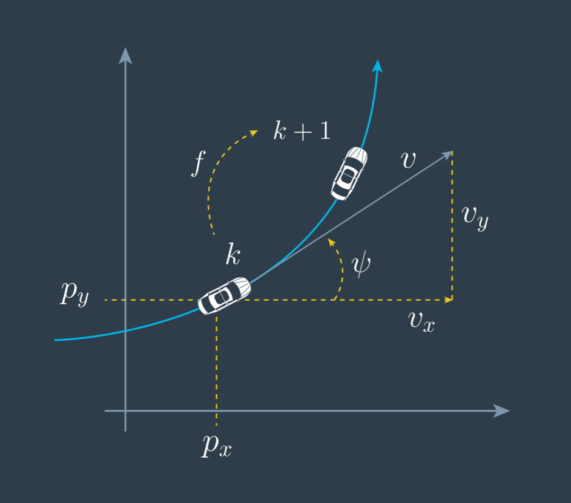

#Unscented Kalman Filter Highway Project

##Rubic
###Compiling and Testing

>Criteria:
>
>The submission must compile.

>Meets specifications
>
>The project code must compile without errors using cmake and make.

###Code Efficiency

>Criteria:
>
>The methods in the code should avoid unnecessary calculations.

>Meets specifications
>
>Your code does not need to sacrifice comprehension, stability, or robustness for speed. However, you should maintain good and efficient coding practices when writing your functions.
>
> Here are some things to avoid. This is not a complete list, but there are a few examples of inefficiencies.
>
> * Running the exact same calculation repeatedly when you can run it once, store the value and then reuse the value later.
> * Loops that run too many times.
> * Creating unnecessarily complex data structures when simpler structures work equivalently.
> * Unnecessary control flow checks.

###Accuracy

>Criteria:
>
>px, py, vx, vy output coordinates must have an RMSE <= [0.30, 0.16, 0.95, 0.70] after running for longer than 1 second.

>Meets specifications
>
>The simulation collects the position and velocity values that your algorithm outputs and they are compare to the ground truth data. Your px, py, vx, and vy RMSE should be less than or equal to the values [0.30, 0.16, 0.95, 0.70] after the simulator has ran for longer than 1 second. The simulator will also display if RMSE values surpass the threshold.

###Follows the Correct Algorithm

>Criteria:
>
>Your Sensor Fusion algorithm follows the general processing flow as taught in the preceding lessons.

>Meets specifications
>
>While you may be creative with your implementation, there is a well-defined set of steps that must take place in order to successfully build a Kalman Filter. As such, your project should follow the algorithm as described in the preceding lesson.

##Project Description

###Introduction

####CTRV Model

Within this project, cars shall be tracked with a **C**onstant **T**urn **R**ate and **V**elocity magnitude model (CTRV model), using a kalman filter. Since non-linear functions are involved, an unscented kalman filter will be used, but details on this will follow.



**Figure 1** - CTRV model - Source: Udacity

The general state vector of the CTRV model consists of five elements:


Where  and  are the cartesian coordinates in 2D space,  is the velocity (from the perspective of the tracking object),  is the yaw angle and  ist the yaw rate.

%20%5Ccdot%20v)

%20%5Ccdot%20v)


%20-%20sin(%5Cdot%7B%5CPsi_k%7D))%20%5C%5C%20%5Cfrac%7Bv_k%7D%7B%5CPsi_k%7D%20(-cos(%5CPsi_k%20%2B%20%5Cdot%7B%5CPsi_k%7D%5CDelta%20t)%20%2B%20cos(%5Cdot%7B%5CPsi_k%7D))%20%5C%5C%200%20%5C%5C%20%5Cdot%7B%5CPsi_k%7D%20%5CDelta%20t%20%5C%5C%200%20%5Cend%7Bbmatrix%7D)


####Kalman filter

For this project two sensors will be used as input for the kalman filter, to estimate the position of the object to be tracked. The estimation process is split into a state prediction step and and a measurement update step.


**Figure 2** - project map - Source: Udacity

Both steps work on the state of an object. Earlier in the CTRV model section the state was been described by the general state vector. Since the kalman filter is performing an estimation on this state, the values obviously won't be absolutely the ground truth. So in terms of the kalman filter we are talking about a so called "mean state vector" **x**, because the state elements (e.g. x & y coordinates) are been represented by an gaussian distribution, where the "mean" is been given by the "mean state vector".
The gaussian distribution, or more practically the uncertainty of the state is been described by the covariance matrix **P**.

Both, the state **x** and the covariance matrix **P** need to be initialized with the first measurements before the iteration through the estimation process can start.

Let's assume we start with an initialized state at point in time k ( ), the filter will iterate through the following steps:

* receiving a measurement after  or 
* predict the new state ( ) after  not considering the new measurement yet
* update to the new state ( ) based on the prediction **and** the measurement. The prediction and the measurement are weighted based on their uncertainty.

This basically means that the new state will be a bit more biased on either the measurement or the prediction, depending on the trustworthiness, expressed through the uncertainty given by the covariance matrix.
This will be repeated for each measurement and both sensors. E.g. if there is a lidar (L) measurement coming in followed by a radar (R) measurement, the filter will perform the same steps sequentially for both measurements.


**Figure 3** - flow of kalman filter - Source: Udacity

If the measurements would come in at the same time, the filter would just start with one of the measurements and proceed with the other, the order of the sensors won't matter in this case, but the second prediction step could actually been skipped since it would produce the same results as the first time.

#####state prediction

To predict the state in the next time step a state transition function is needed. The general form looks like the following:

%20%2B%20%5Cnu)

where  is the state transition matrix,  is the so called control input matrix,  is the corresponding control vector and  representing process noise.
The control input matrix and vector would normally provide information about the objects internal behaviour, like acceleration at a given point in time, but for this project they will be ignored ( ) since the assumption is, that this information is just not available to our tracking. Instead this lag of information about e.g. the precise acceleration will be considered as process noise .

The process noise is been defined as ) , a gaussian distributed noise, having a mean of zero and a covariance of .

This uncertainty is been considered in the update of the covariance matrix:


This gives us a prediction of the state expressed as gaussian distribution.

#####measurement update

Receiving a sensors measurement  provides data which can be compared to our prediction  via the measurement function .


Like the prediction, the measurement has also an uncertainty which is been describe by the matrix  . This can also be expressed as a gaussian distributed measurement noise ) , with a mean of zero and a covariance  .

The so called kalman gain is combining the uncertainty of the prediction ( ) and the measurement () to give the more certain value a higher weight in the overall result.

 where 

The state after the measurement update calculates as following:


The updated covariance matrix calculates according to the following formula:

P_%7Bk%2B1%7Ck%7D)

###Implementation

####Initialization

```C++
//for lidar the initial state vector will be initialized directly with the raw cartesian coordinates from the raw measurement
        if (meas_package.LASER == meas_package.sensor_type_) {
            auto px = meas_package.raw_measurements_(0);
            auto py = meas_package.raw_measurements_(1);
            x_ << px, py, 0, 0, 0;

            //for radar the raw measurement needs to be translated to cartesian coordinates first before initializing the state vector
        } else if (meas_package.RADAR == meas_package.sensor_type_) {
            auto roh = meas_package.raw_measurements_(0);
            auto theta = meas_package.raw_measurements_(1);
            auto roh_dot = meas_package.raw_measurements_(2);
            auto px = roh * cos(theta);
            auto py = roh * sin(theta);
            x_ << px, py, roh_dot, theta, 0;
```

```C++
/**
   * the covariance matrix gets initialized with
   * process noise standard deviation longitudinal acceleration std_a_ and
   * process noise standard deviation yaw acceleration std_yawdd_
  **/
  P_ = MatrixXd::Identity(n_x_, n_x_);
  P_(2, 2) = std_a_ * std_a_;
  P_(3, 3) = std_yawdd_ * std_yawdd_;

```

####prediction

Since the transfer functions of the CTRV model are non-linear, the unscented version of the kalman filter has been used.

TODO: extend UKF description

```C++
void UKF::Prediction(double delta_t) {
    /**
     * Modify the state vector, x_. Predict sigma points, the state,
     * and the state covariance matrix.
     */
    GenerateSigmaPoints();
    PredictSigmaPoints(delta_t);
    PredictMeanAndCovariance();
}
```

####update

```C++
if (is_initialized_) {

    Prediction(delta_t);
    if (meas_package.sensor_type_ == MeasurementPackage::LASER && use_laser_) {
        UpdateLidar(meas_package);
    } else if (meas_package.sensor_type_ == MeasurementPackage::RADAR && use_radar_) {
        UpdateRadar(meas_package);
    } else {
        return;
    }
```

```C++
// update state mean and covariance matrix
x_ = x_ + K_ * (z_ - z_pred_);
P_ = P_ - K_ * S_ * K_.transpose();
```
